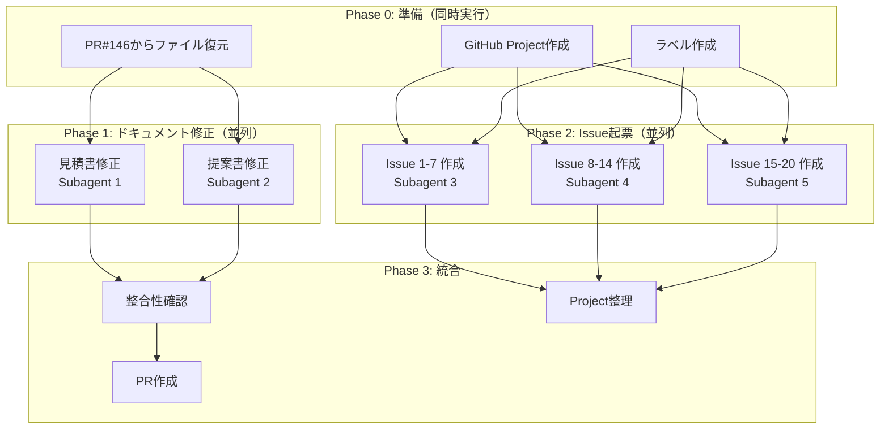

# 提案書・見積書の全面修正計画

## 概要

PR#146の提案書・見積書について、以下を修正：
1. 費用誤記の修正
2. AI実装前提での工数見直し
3. PM工数を各機能に内包（15%）
4. **仕様確認工数の増加**（各機能+0.3〜0.5d）

---

## 1. 工数計算ルール

### 各機能の工数構成

```
基礎開発工数 = AI効率化後の開発工数
仕様確認追加 = +0.3〜0.5d（機能複雑度による）
PM工数 = (基礎開発 + 仕様確認) × 15%
総工数 = 基礎開発 + 仕様確認 + PM
機能費用 = 総工数 × 18万円/日
```

### 仕様確認追加の基準

| 機能複雑度 | 追加工数 | 対象機能の例 |
|-----------|----------|-------------|
| 低 | +0.3d | 回答ソース表示、iframe等 |
| 中 | +0.4d | モバイル対応、履歴保持等 |
| 高 | +0.5d | エントリー連携、GDPR等 |

---

## 2. 機能別修正一覧（仕様確認・PM工数込み）

### チャットボット機能（12件）

| No. | 機能名 | 開発 | 仕様確認 | PM(15%) | **総工数** | **金額** |
|-----|--------|------|----------|---------|-----------|----------|
| 1 | 回答ソース表示 | 0.5d | 0.3d | 0.1d | **0.9d** | **16万円** |
| 2 | モバイル対応 | 3.0d | 0.4d | 0.5d | **3.9d** | **70万円** |
| 3 | 問い合わせ先案内 | 2.0d | 0.4d | 0.4d | **2.8d** | **50万円** |
| 4 | 応答速度改善 | 5.0d | 0.4d | 0.8d | **6.2d** | **112万円** |
| 5 | 会話履歴保持 | 3.5d | 0.4d | 0.6d | **4.5d** | **81万円** |
| 6 | 会場間移動ナビ | 5.0d | 0.5d | 0.8d | **6.3d** | **113万円** |
| 7 | ビザ・入国案内 | 3.0d | 0.5d | 0.5d | **4.0d** | **72万円** |
| 8 | 競技別資格チェッカー | 4.5d | 0.5d | 0.8d | **5.8d** | **104万円** |
| 9 | 満足度フィードバック | 1.5d | 0.3d | 0.3d | **2.1d** | **38万円** |
| 10 | PIIフィルタ | 2.8d | 0.4d | 0.5d | **3.7d** | **67万円** |
| 11 | iframe動的リサイズ | 1.0d | 0.3d | 0.2d | **1.5d** | **27万円** |
| 12 | UI強化（アニメーション） | 2.3d | 0.3d | 0.4d | **3.0d** | **54万円** |
| | **小計** | 34.1d | 4.7d | 5.9d | **44.7d** | **804万円** |

#### 各機能の想定仕様（チャットボット）

**No.1 回答ソース表示** ★クライアント要望
- チャット回答の根拠となったナレッジソース（ドキュメント名、セクション）を表示
- ユーザーが回答の信頼性を確認可能
- 「詳細を見る」リンクでソースドキュメントへ遷移

**No.2 モバイル対応**
- レスポンシブデザインでスマートフォン・タブレットに最適化
- タッチ操作に対応したUI（ボタンサイズ、スワイプ操作）
- モバイルブラウザでの動作検証（iOS Safari, Android Chrome）

**No.3 問い合わせ先案内**
- AIで解決できない質問に対して適切な問い合わせ先を案内
- カテゴリ別の問い合わせ窓口（チケット、宿泊、競技等）を表示
- 営業時間・対応言語の情報を含む

**No.4 応答速度改善**
- ストリーミングレスポンスの最適化（チャンク単位の送信）
- RAG検索のキャッシュ導入（類似質問の高速応答）
- 初回応答までの時間を3秒以内に短縮

**No.5 会話履歴保持**
- ブラウザセッション内での会話履歴を保持
- 過去の質問・回答を参照可能なUI
- 新規セッション開始ボタンで履歴クリア

**No.6 会場間移動ナビ**
- 競技会場間の移動ルート・所要時間を案内
- 公共交通機関の乗り換え情報
- 地図連携（Google Maps/Apple Maps）

**No.7 ビザ・入国案内**
- 国籍別のビザ要件を案内
- 入国手続きの流れ（税関申告、検疫等）
- 必要書類のチェックリスト

**No.8 競技別資格チェッカー**
- 年齢・資格等の条件をインタラクティブに確認
- 各競技の参加要件をQ&A形式で案内
- 不適格の場合は代替案を提示

**No.9 満足度フィードバック**
- 各回答に対する👍/👎評価ボタン
- オプションのコメント入力
- フィードバックデータの集計・分析

**No.10 PIIフィルタ**
- ユーザー入力から個人情報（氏名、電話、メール等）を検出
- PII検出時に警告表示・送信前確認
- ログへのPII記録を防止

**No.11 iframe動的リサイズ**
- 埋め込み先ページに合わせたiframeサイズ調整
- チャット展開時・折りたたみ時の高さ変更
- postMessageによる親ページとの連携

**No.12 UI強化（アニメーション）**
- メッセージ表示時のフェードイン・スライドアニメーション
- タイピングインジケーター（「入力中...」表示）
- スムーズなスクロール動作

### 管理画面機能（5件）

| No. | 機能名 | 開発 | 仕様確認 | PM(15%) | **総工数** | **金額** |
|-----|--------|------|----------|---------|-----------|----------|
| 13 | ナレッジ優先度管理 | 1.5d | 0.4d | 0.3d | **2.2d** | **40万円** |
| 14 | 利用ログ可視化＋応答改善FB | 6.5d | 0.4d | 1.0d | **7.9d** | **142万円** |
| 15 | プロンプト編集機能 | 2.8d | 0.4d | 0.5d | **3.7d** | **67万円** |
| 16 | ファイルダウンロード機能 | 1.5d | 0.3d | 0.3d | **2.1d** | **38万円** |
| 17 | 利用状況ダッシュボード | 3.0d | 0.4d | 0.5d | **3.9d** | **70万円** |
| | **小計** | 15.3d | 1.9d | 2.6d | **19.8d** | **357万円** |

#### 各機能の想定仕様（管理画面）

**No.13 ナレッジ優先度管理** ★クライアント要望
- RAG検索で参照するナレッジの優先度を設定
- ドキュメント単位での優先度（高/中/低）設定UI
- 優先度変更の即時反映

**No.14 利用ログ可視化＋応答改善FB** ★クライアント要望
- セッション単位でのチャット会話一覧
- 各応答に対する管理者評価機能（👍/👎/コメント）
- フィードバックに基づく改善サイクル（プロンプト/ナレッジ修正）
- 検索・フィルタ機能（日時、評価、キーワード）
- CSVエクスポート

**No.15 プロンプト編集機能**
- システムプロンプトのGUI編集
- プロンプトテンプレートの管理（言語別、シーン別）
- 変更履歴・ロールバック機能

**No.16 ファイルダウンロード機能**
- ログデータのCSV/Excel形式ダウンロード
- 期間・条件を指定したエクスポート
- 定期レポート自動生成（オプション）

**No.17 利用状況ダッシュボード**
- 利用統計グラフ（日別/週別/月別）
- 質問カテゴリ分布
- 応答成功率・満足度推移

### 新規/拡張機能（3件）

| No. | 機能名 | 開発 | 仕様確認 | PM(15%) | **総工数** | **金額** |
|-----|--------|------|----------|---------|-----------|----------|
| 18 | エントリーシステム連携 | 6.0d | 0.5d | 1.0d | **7.5d** | **135万円** |
| 19 | GDPR対応 | 9.0d | 0.5d | 1.4d | **10.9d** | **196万円** |
| 20 | RAG検索改善 | 0.4d | 0.1d | 0.1d | **0.6d** | **8万円** |
| | **小計** | 15.4d | 1.1d | 2.5d | **19.0d** | **339万円** |

#### 各機能の想定仕様（新規/拡張）

**No.18 エントリーシステム連携**
- WMG2027エントリーシステムとのAPI連携
- ログインユーザーの登録情報に基づくパーソナライズ回答
- エントリー状況（登録済競技、参加日程等）の参照
- 認証連携（SSO/OAuth）

**No.19 GDPR対応**
- Cookie同意バナー（オプトイン/オプトアウト）
- プライバシーポリシー表示
- データ削除リクエスト対応機能
- 監査ログの保管（アクセス履歴）
- EU地域ユーザー向けのデータ処理制限

**No.20 RAG検索改善** ★クライアント要望
- マニフェスト依存を削除
- File Search Storeのmetadataベースでのドキュメント検索
- 検索精度・パフォーマンスの向上

---

## 3. 最終見積サマリー

| カテゴリ | 開発 | 仕様確認 | PM | 総工数 | 金額（税抜） |
|----------|------|----------|-----|--------|-------------|
| チャットボット（12件） | 34.1d | 4.7d | 5.9d | 44.7d | 804万円 |
| 管理画面（5件） | 15.3d | 1.9d | 2.6d | 19.8d | 357万円 |
| 新規/拡張（3件） | 15.4d | 1.1d | 2.5d | 19.0d | 339万円 |
| **総計（20件）** | **64.8d** | **7.7d** | **11.0d** | **83.5d** | **1,500万円** |

※ No.14の工数増加: +2d（セッション管理、FB機能、改善連携）
※ No.20 RAG検索改善: 0.6d（Issue #147より）

### 税込金額

| 項目 | 金額 |
|------|------|
| 税抜 | 1,500万円 |
| 消費税（10%） | 150万円 |
| **税込** | **1,650万円** |

### 比較

| 項目 | 現状 | 修正後 | 差異 |
|------|------|--------|------|
| 総工数 | 71.7d | 83.5d | +11.8d（+16%） |
| 総額（税抜） | 1,289万円 | 1,500万円 | +211万円（+16%） |

### 工数内訳比率

| フェーズ | 工数 | 比率 | ルール |
|----------|------|------|--------|
| 仕様確認 | 7.9d | 9.4% | 10-15% |
| 開発（設計+実装+テスト） | 64.8d | 77.4% | - |
| PM | 11.0d | 13.1% | 15-20% |

---

## 4. 提案書への反映

### 4.1 提案機能一覧の修正

**追加項目**:
- 「クライアント要望」フラグ列を追加
- **No.20 RAG検索改善**（Issue #147）を新規追加
- **No.14 利用ログ可視化**の仕様拡張

| No. | 機能名 | カテゴリ | 要望※ | 概算費用 |
|-----|--------|---------|:-----:|----------|
| 1 | 回答ソース表示 | チャットボット | **★** | **約16万円** |
| 2 | モバイル対応 | チャットボット | | **約70万円** |
| 3 | 問い合わせ先案内 | チャットボット | | **約50万円** |
| 4 | 応答速度改善 | チャットボット | | **約112万円** |
| 5 | 会話履歴保持 | チャットボット | | **約81万円** |
| 6 | 会場間移動ナビ | チャットボット | | **約113万円** |
| 7 | ビザ・入国案内 | チャットボット | | **約72万円** |
| 8 | 競技別資格チェッカー | チャットボット | | **約104万円** |
| 9 | 満足度フィードバック | チャットボット | | **約38万円** |
| 10 | PIIフィルタ | チャットボット | | **約67万円** |
| 11 | iframe動的リサイズ | チャットボット | | **約27万円** |
| 12 | UI強化 | チャットボット | | **約54万円** |
| 13 | ナレッジ優先度管理 | 管理画面 | **★** | **約40万円** |
| 14 | 利用ログ可視化＋応答改善FB | 管理画面 | **★** | **約142万円** |
| 15 | プロンプト編集機能 | 管理画面 | | **約67万円** |
| 16 | ファイルダウンロード | 管理画面 | | **約38万円** |
| 17 | 利用状況ダッシュボード | 管理画面 | | **約70万円** |
| 18 | エントリーシステム連携 | 新規拡張 | | **約135万円** |
| 19 | GDPR対応 | 新規拡張 | | **約196万円** |
| 20 | RAG検索改善 | 新規拡張 | **★** | **約8万円** |
| - | **全機能合計（20件）** | | | **約1,500万円** |

※ ★ = クライアント要望による機能

### 4.2 No.14 仕様変更（利用ログ可視化 → 利用ログ可視化＋応答改善FB）

**旧仕様**: 管理画面でチャットログの検索・閲覧・エクスポート

**新仕様**:
1. **セッション単位の会話管理**: チャット応答をセッション単位で管理画面から確認
2. **応答品質フィードバック**: 管理者が各応答の良し悪しを評価（👍/👎/コメント）
3. **応答改善サイクル**: フィードバックを元にプロンプト/ナレッジ改善へ反映

**工数増加**: 4.5d → 6.5d（+2d）

| 項目 | 旧工数 | 新工数 |
|------|--------|--------|
| セッション管理機能 | - | +1.0d |
| FB機能（評価UI・保存） | - | +0.5d |
| 改善連携機能 | - | +0.5d |
| **合計** | 4.5d | **6.5d** |

### 4.3 No.20 RAG検索改善（Issue #147より追加）

**概要**: マニフェスト依存を削除し、File Search StoreのmetadataベースでRAG検索を行う

**工数**: 0.45d（3.6h / Issue記載値）

### クライアント要望機能サマリー

| No. | 機能名 | 費用 |
|-----|--------|------|
| 1 | 回答ソース表示 | 16万円 |
| 13 | ナレッジ優先度管理 | 40万円 |
| 14 | 利用ログ可視化＋応答改善FB | 142万円 |
| 20 | RAG検索改善 | 8万円 |
| | **クライアント要望小計** | **206万円** |

---

## 5. 修正対象ファイル

1. **`docs/specifications/proposals/feature-estimate.md`**
   - 各機能の工数内訳に「仕様確認」フェーズを追加
   - PM工数を内包
   - 合計工数・金額を更新（83.5d / 1,500万円）
   - **機能No.を1-20で再採番**（ナレッジ優先度管理→No.13、管理画面カテゴリ）

2. **`docs/specifications/proposals/wmg2027-chatbot-proposal-draft.md`**
   - 機能一覧テーブルの費用更新
   - 合計金額を約1,500万円に更新
   - **月額ライセンス費を11,000円に修正**
   - **機能No.を1-20で再採番**（ナレッジ優先度管理→No.13、管理画面カテゴリ）

### 5.1 月額ライセンス費の修正

**旧**:
| サービス | 月額費用 |
|----------|----------|
| Vercel Pro | 約3,000円 |
| Gemini API | 約3,000〜4,500円 |
| **合計** | **約6,000〜7,500円** |

**新**:
| サービス | 月額費用 |
|----------|----------|
| Vercel Pro | 約3,000円 |
| Gemini API | 約8,000円 |
| **合計** | **約11,000円** |

---

## 6. 並列実行計画（Subagent活用）

### 6.1 作業依存関係図



### 6.2 Phase別タスク詳細

#### Phase 0: 準備作業（並列実行可能）

| タスク | 担当 | 依存 | 所要時間 |
|--------|------|------|----------|
| PR#146からファイル復元 | Main | なし | 1分 |
| GitHub Project V2作成 | Main | なし | 1分 |
| ラベル作成（enhancement, proposal, client-request） | Main | なし | 30秒 |

#### Phase 1: ドキュメント修正（**2 Subagent並列**）

| Subagent | タスク | 入力 | 出力 |
|----------|--------|------|------|
| **Subagent 1** | 見積書（feature-estimate.md）修正 | 計画セクション2の工数表 | 修正済みファイル |
| **Subagent 2** | 提案書（proposal-draft.md）修正 | 計画セクション4の費用表 + ライセンス費修正 | 修正済みファイル |

#### Phase 2: Issue起票（**3 Subagent並列**）

| Subagent | 担当Issue | 件数 |
|----------|-----------|------|
| **Subagent 3** | No.1〜7（チャットボット前半） | 7件 |
| **Subagent 4** | No.8〜14（チャットボット後半+管理画面） | 7件 |
| **Subagent 5** | No.15〜20（管理画面残り+新規拡張） | 6件 |

#### Phase 3: 統合（順次実行）

1. ドキュメント整合性確認（見積書 ↔ 提案書の金額一致）
2. コミット＆PR作成
3. 全IssueをProjectに追加・フィールド設定

### 6.3 Subagent指示テンプレート

#### Subagent 1: 見積書修正

```
タスク: docs/specifications/proposals/feature-estimate.md の修正

修正内容:
1. 各機能に「仕様確認」工数列を追加（0.3〜0.5d）
2. PM工数を各機能に15%で内包
3. No.14の工数を7.9dに増加（応答改善FB追加）
4. No.20「RAG検索改善」を追加（0.6d / 8万円）
5. 総計を83.5d / 1,500万円に更新
6. 機能No.を1-20で再採番（ナレッジ優先度管理はNo.13へ移動）

参照: 計画ファイルのセクション2「機能別修正一覧」
```

#### Subagent 2: 提案書修正

```
タスク: docs/specifications/proposals/wmg2027-chatbot-proposal-draft.md の修正

修正内容:
1. 機能一覧テーブルの費用を計画どおり更新
2. 「クライアント要望」列を追加（★フラグ: No.1,13,14,20）
3. No.20「RAG検索改善」を追加
4. No.14の機能名を「利用ログ可視化＋応答改善FB」に変更
5. 月額ライセンス費を11,000円に修正
6. 合計金額を約1,500万円に更新
7. 機能No.を1-20で再採番（ナレッジ優先度管理はNo.13へ）

参照: 計画ファイルのセクション4,5
```

#### Subagent 3-5: Issue起票

```
タスク: GitHub Issue起票（No.X〜Y）

手順:
1. gh issue create でIssue作成
2. ラベル: enhancement, proposal（★は+client-request）
3. 本文テンプレート使用

Issue情報: 計画ファイルのセクション8.2参照
```

---

## 7. 検証方法

- [ ] 各機能: 費用 = 総工数 × 18万円/日
- [ ] 仕様確認工数が各機能に0.3〜0.5d含まれている
- [ ] PM工数 ≒ (開発+仕様確認) × 15%
- [ ] 提案書と見積書の金額一致
- [ ] 合計金額が約1,500万円（税抜）
- [ ] 月額ライセンス費が11,000円
- [ ] 機能No.が1-20で連番
- [ ] クライアント要望: No.1, 13, 14, 20に★
- [ ] GitHub Projectに20件のIssueが登録済み

---

## 8. GitHub Projectバックログ起票

### 8.1 Project設定

**プロジェクト名**: `WMG2027 AIチャットボット機能開発`

**カスタムフィールド**:
| フィールド名 | 型 | オプション |
|-------------|-----|-----------|
| カテゴリ | Single Select | チャットボット / 管理画面 / 新規拡張 |
| クライアント要望 | Checkbox | - |
| 見積工数 | Number | 単位: 人日 |
| 見積費用 | Number | 単位: 万円 |
| 優先度 | Single Select | 高 / 中 / 低 |

### 8.2 起票するIssue一覧（20件）

| No. | タイトル | カテゴリ | 要望 | 工数 | 費用 |
|-----|---------|---------|:----:|------|------|
| 1 | 回答ソース表示機能 | チャットボット | ★ | 0.9d | 16万円 |
| 2 | モバイル対応（レスポンシブUI） | チャットボット | | 3.9d | 70万円 |
| 3 | 問い合わせ先案内機能 | チャットボット | | 2.8d | 50万円 |
| 4 | 応答速度改善（ストリーミング最適化） | チャットボット | | 6.2d | 112万円 |
| 5 | 会話履歴保持機能 | チャットボット | | 4.5d | 81万円 |
| 6 | 会場間移動ナビゲーション | チャットボット | | 6.3d | 113万円 |
| 7 | ビザ・入国案内機能 | チャットボット | | 4.0d | 72万円 |
| 8 | 競技別資格チェッカー | チャットボット | | 5.8d | 104万円 |
| 9 | 満足度フィードバック収集 | チャットボット | | 2.1d | 38万円 |
| 10 | PIIフィルタ（個人情報保護） | チャットボット | | 3.7d | 67万円 |
| 11 | iframe動的リサイズ | チャットボット | | 1.5d | 27万円 |
| 12 | UI強化（アニメーション・UX改善） | チャットボット | | 3.0d | 54万円 |
| 13 | ナレッジ優先度管理機能 | 管理画面 | ★ | 2.2d | 40万円 |
| 14 | 利用ログ可視化＋応答改善FB | 管理画面 | ★ | 7.9d | 142万円 |
| 15 | プロンプト編集機能 | 管理画面 | | 3.7d | 67万円 |
| 16 | ファイルダウンロード機能 | 管理画面 | | 2.1d | 38万円 |
| 17 | 利用状況ダッシュボード | 管理画面 | | 3.9d | 70万円 |
| 18 | エントリーシステム連携 | 新規拡張 | | 7.5d | 135万円 |
| 19 | GDPR対応（データ保護・同意管理） | 新規拡張 | | 10.9d | 196万円 |
| 20 | RAG検索改善（マニフェスト依存削除） | 新規拡張 | ★ | 0.6d | 8万円 |

### 8.3 Issue本文テンプレート

```markdown
## 概要
[機能の簡潔な説明]

## 背景・目的
[なぜこの機能が必要か]

## 実装内容
- [ ] 仕様確認（0.Xd）
- [ ] 設計・実装（X.Xd）
- [ ] テスト
- [ ] PM調整（0.Xd）

## 見積情報
- **総工数**: X.Xd
- **見積費用**: XX万円（税抜）

## 関連情報
- 提案書: docs/specifications/proposals/wmg2027-chatbot-proposal-draft.md
- 見積書: docs/specifications/proposals/feature-estimate.md
```

### 8.4 優先度設定の基準

| 優先度 | 基準 |
|--------|------|
| 高 | クライアント要望（★）、既存Issue（#147） |
| 中 | コア機能（チャット基盤） |
| 低 | 付加機能（UX改善等） |

**高優先度Issue**: No.1, 13, 14, 20（クライアント要望）
