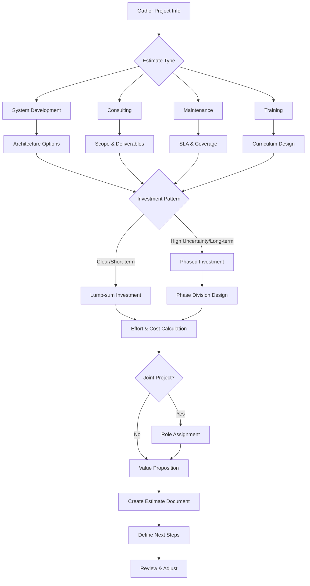
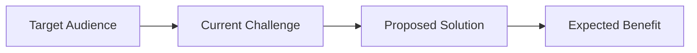

# Rough Estimate Creation Skill

A skill for creating rough estimates for Scibit LLC.

## Scibit Company Information

| Item | Value |
|------|-------|
| Company Name | Scibit LLC |
| Hourly Rate | ¥15,000/hour (tax excluded) |
| Daily Rate | ¥120,000 (8 hours) |
| Monthly Rate | ¥2,400,000 (20 days) |
| Contact | contact@scibit.ai |

### Rate Display Options

For client-facing estimates, the hourly rate can be hidden:

| Mode | Display Content | Use Case |
|------|-----------------|----------|
| Detailed Mode | Show hours, rate, and amount | Internal review, transparency-focused clients |
| Simple Mode | Show hours and amount only (rate hidden) | General client-facing |
| Amount Mode | Show amount only | Executive summaries |

**Simple Mode Example:**
```markdown
| Phase | Hours | Amount |
|-------|-------|--------|
| PM & Requirements | 16h | ¥240,000 |
| Design | 20h | ¥300,000 |
```

**Note:** Always verify internally using `Hours × ¥15,000 = Amount`

## Estimate Creation Flow



### Phased Investment Criteria

Consider phased investment (Phase division) when any of the following apply:

- High uncertainty projects (technical validation needed, fluid requirements)
- Projects requiring data accumulation or AI learning
- Long-term projects (1+ years)
- Large investments (¥10,000,000+)

### Joint Project Identification

For multi-company projects, clarify:

- Estimate scope and responsibility boundaries
- Role assignment table (RACI)
- Integration interface specifications

### Step 1: Confirm Project Information

Confirm the following:

1. **Client Name**
2. **Project Name**
3. **Project Type**: System Development / Consulting / Maintenance / Training
4. **Overview**: What needs to be achieved
5. **Desired Timeline**: If applicable
6. **Budget Range**: If applicable
7. **Special Notes**: Constraints, etc.

### Step 2: Select Estimate Type

Use appropriate template based on project type:

| Type | Reference File | Characteristics |
|------|----------------|-----------------|
| System Development | [estimate-types.md](references/estimate-types.md) | Phase-based effort, architecture comparison |
| Consulting | [estimate-types.md](references/estimate-types.md) | Duration/deliverable-based |
| Maintenance | [estimate-types.md](references/estimate-types.md) | Monthly fee, SLA definition |
| Training | [estimate-types.md](references/estimate-types.md) | Headcount/session-based |

### Step 3: Document Structure

Reference [document-structure.md](references/document-structure.md) and include:

**Required Sections:**
1. Header information (date, validity period, recipient)
2. Rough estimate disclaimer
3. Executive summary
4. Estimated costs
5. Inclusions/Exclusions
6. Terms & disclaimers
7. Contact information

**Optional Sections (as applicable):**
- Current situation analysis
- Solution overview
- Architecture options (comparison table, Mermaid diagrams)
- Implementation roadmap (Gantt chart)
- ROI analysis
- Risks and mitigation
- Role assignment table (for joint projects)
- Value proposition table (by stakeholder)
- Next steps (recommended actions)

### Step 4: Effort & Cost Calculation

Reference [cost-estimation.md](references/cost-estimation.md):

**Phase-based Effort Ratio (MVP Development):**

| Phase | Ratio |
|-------|-------|
| PM & Client Coordination | 10-12% |
| Requirements & Design | 12-16% |
| Environment Setup | 10-14% |
| Data Migration | 15-20% |
| Core Development | 20-25% |
| UI Development | 10-14% |
| Testing & Adjustments | 10-12% |
| Handover | 5-6% |
| Buffer | 4-5% |

### Step 5: Double-Check Calculations

Before outputting the estimate, verify:

**Calculation Verification Checklist:**
```
Amount Verification:
- [ ] Hours × Rate = Amount matches for all rows
- [ ] Subtotals sum to total
- [ ] Monthly × 12 = Annual (for running costs)
- [ ] Initial + Annual Running = Year 1 Total Cost
```

**Verification Steps:**
1. Verify each row: `Hours × ¥15,000 = Amount`
2. Recalculate subtotal sums
3. Verify annual running = monthly × 12
4. Check ROI assumptions align with results
5. Ensure comparison table options use consistent logic

**Common Calculation Errors:**
- Digit errors (e.g., 40h → ¥60,000 instead of ¥600,000)
- Missing annual conversion for monthly costs
- Including tax (should be tax-excluded)

### Step 6: Include Disclaimers

Reference [disclaimers.md](references/disclaimers.md) and always specify:

- **This is a rough estimate**
- **Tax-excluded pricing**
- **Validity period** (typically 1 month)
- **Inclusions/Exclusions**
- **Variable factors**

## Template

Ready-to-use template: [template.md](assets/template.md)

## Quick Reference

### Effort Guidelines (System Development)

| Scale | Effort | Duration | Estimated Cost |
|-------|--------|----------|----------------|
| Small | 40-80h | 2-4 weeks | ¥600,000-1,200,000 |
| Medium | 200-400h | 2-4 months | ¥3,000,000-6,000,000 |
| Large | 800h+ | 6+ months | ¥12,000,000+ |

### Cost Structure Patterns

| Type | Initial Cost | Running Cost |
|------|--------------|--------------|
| On-premise | High | Low |
| Hybrid | Medium | Medium |
| Cloud | Low | High |

### Maintenance Plan Guidelines

| Plan | Coverage Hours | Monthly Fee |
|------|----------------|-------------|
| Light | Weekdays 10-18 | ¥150,000+ |
| Standard | Weekdays 9-21 | ¥300,000+ |
| Premium | 24/7/365 | ¥600,000+ |

## Important Notes

1. **Output documents in Japanese** - All estimate documents must be written in Japanese
2. **Always state this is a rough estimate** - Formal quote separate
3. **Tax-excluded pricing** - Consumption tax additional
4. **Set validity period** - Typically 1 month
5. **Specify exclusions** - Infrastructure, licenses, etc.
6. **Explain variable factors** - Impact of requirement changes

## Joint Project Role Assignment

For multi-company projects, clarify roles using RACI format:

| Role | R (Responsible) | A (Accountable) | C (Consulted) | I (Informed) |
|------|-----------------|-----------------|---------------|--------------|
| Requirements | Prime Contractor | Client | Scibit | - |
| AI Design | Scibit | Prime Contractor | - | Client |
| Development | Prime/Scibit | Prime Contractor | - | Client |

**Scope Clarification:**
- **Included** in this estimate: Scibit's scope of work
- **Not included**: Other parties' work, infrastructure, licenses, etc.

## Value Proposition Structure

Explain value through the flow: Problem → Solution → Benefit



**Stakeholder Value Table:**

| Stakeholder | Current Challenge | Solution | Expected Benefit |
|-------------|-------------------|----------|------------------|
| Executives | ... | ... | ... |
| Operations Staff | ... | ... | ... |
| End Users | ... | ... | ... |

## Next Steps Definition

Clarify post-submission actions:

1. **Confirmation Items** - Items to verify for estimate accuracy
2. **Recommended Actions** - Prioritized next steps
3. **Timeline** - Milestones and deadlines

## Reference Documents

- [Document Structure](references/document-structure.md) - Section layout, Mermaid diagram patterns
- [Cost Estimation](references/cost-estimation.md) - Calculation methods, ROI, multi-layer cost structure
- [Disclaimers](references/disclaimers.md) - Notes, disclaimer templates
- [Estimate Types Guide](references/estimate-types.md) - Development/Consulting/Maintenance/Training, phased investment
- [Template](assets/template.md) - Copy and use
