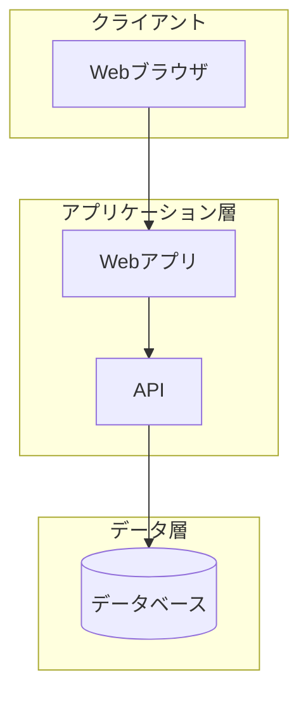

# {{件名}} 概算見積書

| 項目 | 内容 |
|------|------|
| 作成日 | {{作成日}} |
| 版数 | 第1版 |
| 有効期限 | {{有効期限}} |
| 提出者 | 合同会社サイビット |
| 宛先 | {{顧客名}}御中 |

---

## 本見積書について

> **重要**: 本見積書は概算見積りです。

- 本見積書は**概算見積り**であり、正式なお見積りは別途ご提示いたします
- 金額はすべて**税抜き**表示です
- 詳細なヒアリング・要件定義後、正式見積りにて変動する可能性があります
- 本見積書の有効期限は**{{有効期限}}**までとなります

---

## エグゼクティブサマリー

{{案件の概要を1〜2段落で記述}}

---

## 現状の課題

### 現状環境
{{現状のシステム・運用状況}}

### 課題一覧

| # | 課題 | 影響 | 優先度 |
|---|------|------|--------|
| 1 | {{課題1}} | {{影響1}} | 高/中/低 |
| 2 | {{課題2}} | {{影響2}} | 高/中/低 |
| 3 | {{課題3}} | {{影響3}} | 高/中/低 |

---

## ソリューション概要

### 提案内容
{{提案するソリューションの概要}}

### 期待される効果
- {{効果1}}
- {{効果2}}
- {{効果3}}

---

## アーキテクチャ選択肢

### 比較表

| 観点 | オプションA<br>{{名称A}} | オプションB<br>{{名称B}} | オプションC<br>{{名称C}} |
|------|-------------------------|-------------------------|-------------------------|
| 初期コスト | {{評価}} | {{評価}} | {{評価}} |
| ランニング | {{評価}} | {{評価}} | {{評価}} |
| スケーラビリティ | {{評価}} | {{評価}} | {{評価}} |
| 保守性 | {{評価}} | {{評価}} | {{評価}} |
| 導入期間 | {{評価}} | {{評価}} | {{評価}} |

### システム構成図



---

## 推奨アーキテクチャ

**推奨: オプション{{推奨オプション}}**

### 推奨理由
{{推奨理由を記述}}

---

## 導入ロードマップ

```mermaid
gantt
    title プロジェクトスケジュール
    dateFormat  YYYY-MM-DD
    section Phase 1: 設計
    要件定義      :a1, {{開始日}}, 2w
    設計          :a2, after a1, 2w
    section Phase 2: 開発
    開発          :b1, after a2, 4w
    テスト        :b2, after b1, 2w
    section Phase 3: 導入
    導入準備      :c1, after b2, 1w
    本番リリース  :c2, after c1, 1w
```

### フェーズ詳細

| Phase | 期間 | 内容 |
|-------|------|------|
| Phase 1 | {{期間}} | 要件定義・設計 |
| Phase 2 | {{期間}} | 開発・テスト |
| Phase 3 | {{期間}} | 導入・引き渡し |

---

## 概算費用

### 前提条件
- 単価: ¥15,000/時間（税抜き）
- {{その他前提条件}}

### 初期費用

| フェーズ | 工数 | 金額 |
|---------|------|------|
| 要件定義・設計 | {{工数}}h | ¥{{金額}} |
| 環境構築 | {{工数}}h | ¥{{金額}} |
| 開発 | {{工数}}h | ¥{{金額}} |
| テスト | {{工数}}h | ¥{{金額}} |
| 導入・引き渡し | {{工数}}h | ¥{{金額}} |
| PM・管理 | {{工数}}h | ¥{{金額}} |
| **合計** | **{{合計工数}}h** | **¥{{合計金額}}** |

### 月額ランニング費用（該当する場合）

| 項目 | 月額 |
|------|------|
| インフラ費用 | ¥{{金額}} |
| 保守サポート | ¥{{金額}} |
| **月額合計** | **¥{{合計}}** |

### 費用比較サマリー（複数オプションがある場合）

| 項目 | オプションA | オプションB | オプションC |
|------|-------------|-------------|-------------|
| 初期費用 | ¥{{金額}} | ¥{{金額}} | ¥{{金額}} |
| 月額費用 | ¥{{金額}} | ¥{{金額}} | ¥{{金額}} |
| 年間ランニング | ¥{{金額}} | ¥{{金額}} | ¥{{金額}} |

---

## ROI試算

### 前提
- 現状の作業時間: 月{{時間}}時間
- 人件費単価: ¥{{単価}}/時間
- 導入後の削減率: {{削減率}}%

### 効果試算

| 項目 | 金額 |
|------|------|
| 現状コスト（年間） | ¥{{金額}} |
| 削減効果（年間） | ¥{{金額}} |
| システムコスト（年間） | ¥{{金額}} |
| **純効果（年間）** | **¥{{金額}}** |
| **投資回収期間** | **約{{期間}}** |

---

## リスクと対策

| リスク | 影響度 | 発生確率 | 対策 |
|--------|--------|----------|------|
| {{リスク1}} | 高/中/低 | 高/中/低 | {{対策1}} |
| {{リスク2}} | 高/中/低 | 高/中/低 | {{対策2}} |
| {{リスク3}} | 高/中/低 | 高/中/低 | {{対策3}} |

---

## 成功のためのポイント

### KPI設定例
| KPI | 現状 | 目標 |
|-----|------|------|
| {{KPI1}} | {{現状値}} | {{目標値}} |
| {{KPI2}} | {{現状値}} | {{目標値}} |

---

## 対象者別の価値提案

| 対象者 | 現状の課題 | 解決策 | 期待される効果 |
|--------|-----------|--------|---------------|
| {{対象者1}} | {{課題1}} | {{解決策1}} | {{効果1}} |
| {{対象者2}} | {{課題2}} | {{解決策2}} | {{効果2}} |
| {{対象者3}} | {{課題3}} | {{解決策3}} | {{効果3}} |

### 導入効果（Before/After）

| 観点 | Before | After | 改善率 |
|------|--------|-------|--------|
| {{観点1}} | {{現状}} | {{導入後}} | {{改善率}}% |
| {{観点2}} | {{現状}} | {{導入後}} | {{改善率}}% |

---

## 役割分担（協業案件の場合）

### 関係者
| 組織 | 担当者 | 役割 |
|------|--------|------|
| {{クライアント}} | {{担当者名}} | 発注者 |
| {{元請け}} | {{担当者名}} | 開発全体管理 |
| サイビット | - | {{役割（AI技術支援等）}} |

### RACI表
| タスク | クライアント | 元請け | サイビット |
|--------|-------------|--------|-----------|
| 要件定義 | A | R | C |
| {{タスク2}} | {{RACI}} | {{RACI}} | {{RACI}} |
| {{タスク3}} | {{RACI}} | {{RACI}} | {{RACI}} |

※ R=実行責任, A=説明責任, C=相談, I=報告

---

## 本見積りに含まれるもの

- 設計・開発作業
- 単体テスト・結合テスト
- 開発環境構築
- 基本的なドキュメント（設計書、操作マニュアル）
- プロジェクト管理

## 本見積りに含まれないもの

以下は別途お見積りとなります:

- 本番環境のインフラ費用（クラウド利用料等）
- サードパーティライセンス費用
- データ移行作業（既存データの変換・投入）
- ユーザートレーニング
- 運用保守（リリース後のサポート）

---

## 費用変動の可能性について

以下の要因により、正式見積りにおいて費用が変動する可能性があります:

### 増加要因
- 要件の追加・変更
- 既存システムとの連携が想定より複雑な場合
- データ量が想定を大幅に超える場合

### 減少要因
- 機能スコープの縮小
- 既存資産の活用

---

## 注意事項・免責事項

1. 本見積書は概算であり、詳細なヒアリング・要件定義後に正式見積りをご提示いたします
2. 正式見積りは、本概算見積りから変動する可能性があります
3. 記載金額はすべて税抜きです
4. 本見積書の有効期限経過後は、再見積りが必要となる場合があります

---

## 次のステップ

### ヒアリング確認事項
本見積りの精度向上のため、以下の確認が必要です:

| # | 確認事項 | 目的 | 優先度 |
|---|---------|------|--------|
| 1 | {{確認事項1}} | {{目的1}} | 高 |
| 2 | {{確認事項2}} | {{目的2}} | 高 |
| 3 | {{確認事項3}} | {{目的3}} | 中 |

### 推奨アクション
1. **[高]** {{アクション1}} - {{期限}}
2. **[中]** {{アクション2}} - {{期限}}
3. **[低]** {{アクション3}} - 任意

### タイムライン

```mermaid
gantt
    title 次のステップ
    dateFormat  YYYY-MM-DD
    section 準備
    ヒアリング        :a1, {{開始日}}, 3d
    要件確定          :a2, after a1, 5d
    section 見積り
    正式見積り作成    :b1, after a2, 5d
    見積り提出        :milestone, after b1, 0d
```

---

## お問い合わせ

本見積書に関するご質問・ご相談は下記までお気軽にお問い合わせください。

**合同会社サイビット**
- Email: contact@scibit.ai

ご検討のほど、よろしくお願いいたします。
