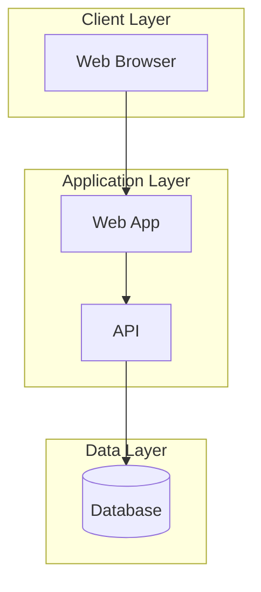
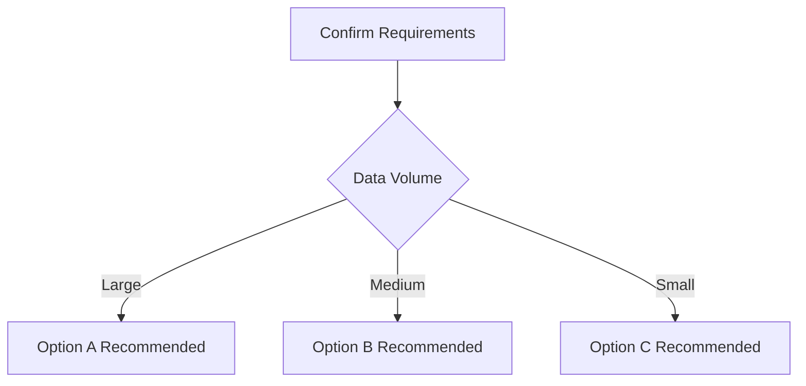
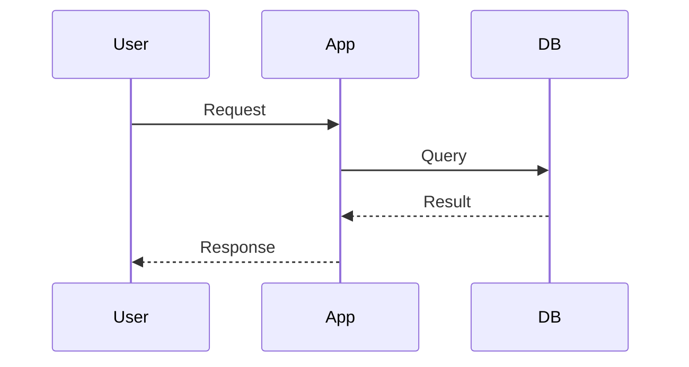
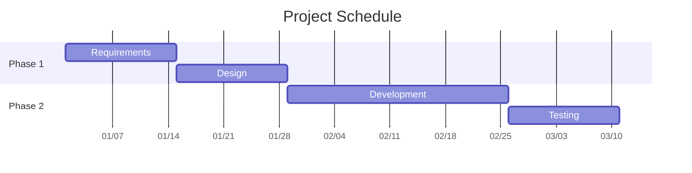
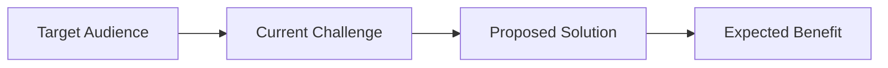
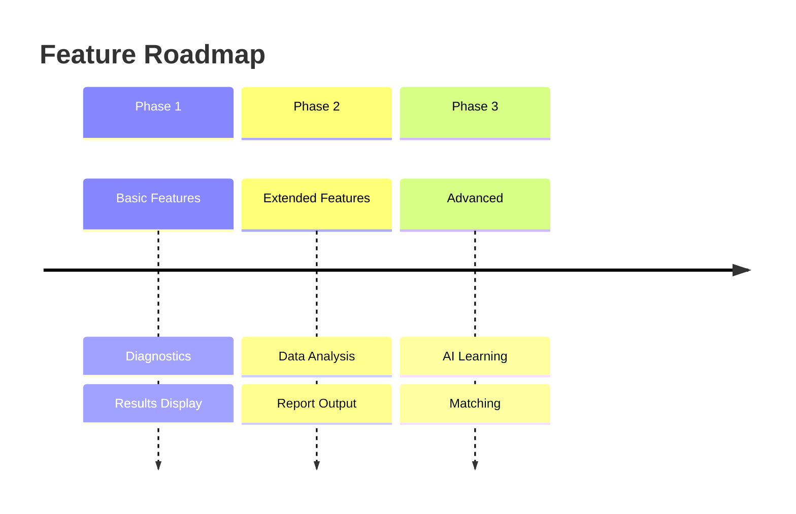
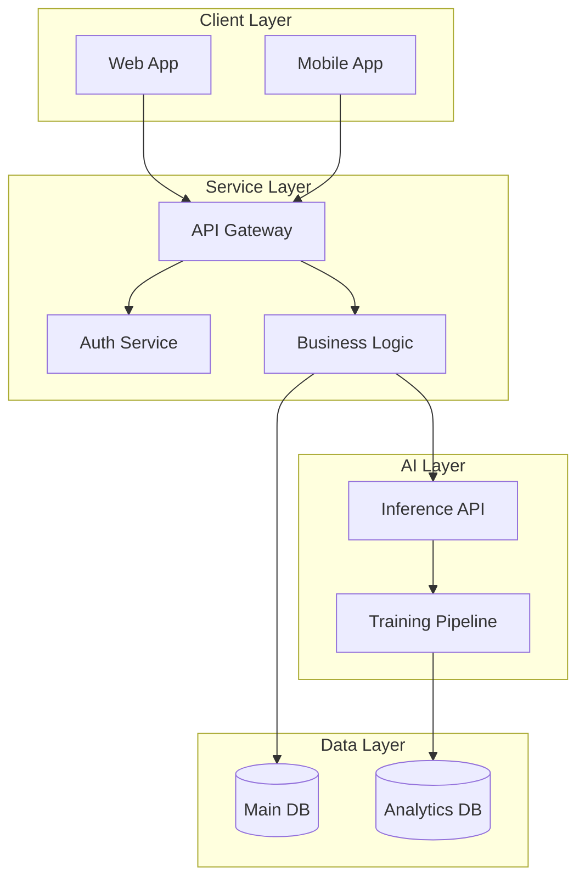
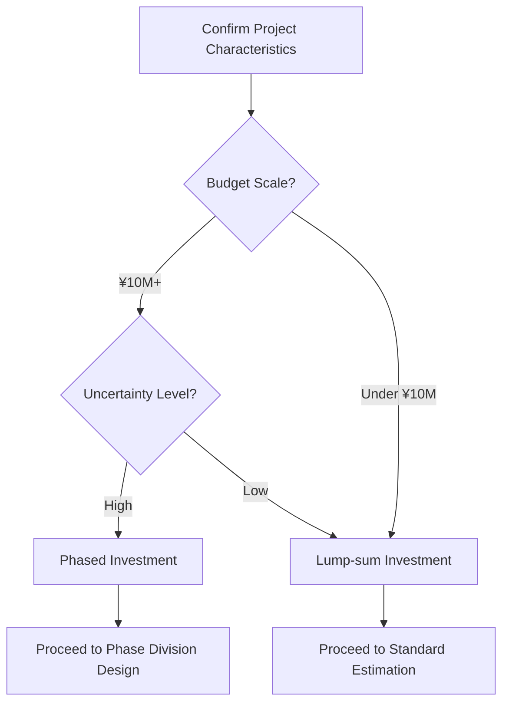

# Rough Estimate Document Structure

Standard section structure and guidelines for rough estimates.

## Table of Contents

- Section Structure (1-19)
- Value Proposition Structure
- Role Assignment (Joint Projects)
- Next Steps
- Mermaid Diagram Usage Guide

## Section Structure

### 1. Header Information
```markdown
# {{Project Name}} Rough Estimate

| Item | Content |
|------|---------|
| Date | {{Date}} |
| Version | v1.0 |
| Valid Until | {{Validity Date (typically 1 month)}} |
| Submitted By | Scibit LLC |
```

### 2. Rough Estimate Disclaimer
```markdown
## About This Estimate

- This is a **rough estimate**; formal quotation will be provided separately
- All amounts are **tax-excluded**
- Final costs may vary after detailed requirements gathering
```

### 3. Executive Summary
- Brief overview in 1-2 paragraphs
- State key value proposition and expected benefits

### 4. Current Situation Analysis
```markdown
## Current Situation

### Current Environment
- Existing systems and operations

### Challenge List
| # | Challenge | Impact | Priority |
|---|-----------|--------|----------|
| 1 | ... | ... | High/Med/Low |
```

### 5. Solution Overview
- Technical explanation (appropriate level)
- Implementation benefits
- Case studies (if available)

### 6. Architecture Options (if applicable)
```markdown
## Architecture Options

### Comparison Table
| Aspect | Option A | Option B | Option C |
|--------|----------|----------|----------|
| Initial Cost | ◎ Low | ○ Medium | △ High |
| Running Cost | △ High | ○ Medium | ◎ Low |
| Scalability | ... | ... | ... |
```

**Mermaid Diagram Example (System Architecture):**


### 7. Recommended Architecture
- Clear recommendation rationale
- Alignment with client requirements

**Selection Guide (Flowchart):**


### 8. Technical Design Details (if applicable)
- Process flow (sequence diagram)
- Security design
- Non-functional requirements

**Sequence Diagram Example:**


### 9. Implementation Roadmap
**Gantt Chart:**


**Gantt Date Display Tips:**
- Adding `axisFormat %m/%d` displays X-axis dates as `01/15` format without year
- `dateFormat` is for data definition (YYYY-MM-DD recommended), `axisFormat` is for display

### 9.5. Technical Feasibility (if applicable)

For projects requiring technical validation, specify feasibility. Keep main document as summary only, with details in separate document:

**Main Document Summary Template:**
```markdown
### Technical Feasibility

> All technologies verified for feasibility based on latest documentation.
> See "[Technical Feasibility Report](technical-feasibility-report.md)" for details.

| Technology | Verification Result |
|------------|---------------------|
| GA4→BigQuery Integration | ✅ Feasible |
| E-commerce Admin API (assuming Shopify) | ✅ Feasible |
| Claude API | ✅ Feasible |
| Streamlit Dashboard | ✅ Feasible |
```

**Separate Document (Technical Feasibility Report) Contents:**
- Verification sources (official documentation, versions)
- Specific code examples and configurations
- Technical risks and mitigation strategies
- Conclusions

### 10. Estimated Costs
- State assumptions
- Cost breakdown by option
- Comparison summary
- ROI analysis (if applicable)

### 11. Risks and Mitigation
```markdown
| Risk | Impact | Probability | Mitigation |
|------|--------|-------------|------------|
| ... | High/Med/Low | High/Med/Low | ... |
```

### 12. Success Factors
- KPI examples
- Critical success factors

### 13. Reference Information
- Technical documentation links
- Related product information

### 14. Appendix (if applicable)
- Technical stack details
- Checklists
- Detailed specifications

### 15. Value Proposition Structure

Explain value through: Challenge → Solution → Benefit



**Value Proposition by Stakeholder:**
```markdown
## Value Proposition by Stakeholder

| Stakeholder | Current Challenge | Solution | Expected Benefit |
|-------------|-------------------|----------|------------------|
| Executives | Lack of data for investment decisions | Data-driven analysis reports | Faster decision-making |
| Managers | Declining operational efficiency | Automation system implementation | 30% effort reduction |
| Operations Staff | Manual work burden | Intuitive UI design | Time savings |
| End Users | Inconsistent service quality | AI-assisted features | Improved satisfaction |
```

**Before/After Comparison:**
```markdown
### Implementation Benefits (Before/After)

| Aspect | Before | After | Improvement |
|--------|--------|-------|-------------|
| Processing Time | XXh/case | XXmin/case | XX% reduction |
| Accuracy | XX% | XX% | XX% improvement |
| Cost | ¥XXX/case | ¥XX/case | XX% reduction |
```

### 16. Role Assignment (for Joint Projects)

For multi-company projects, clarify roles using RACI format:

```markdown
## Role Assignment

### Stakeholders
| Organization | Contact | Role |
|--------------|---------|------|
| End Client | {{Name}} | Client |
| Prime Contractor | {{Company}} | Overall Development Management |
| Scibit | - | AI Technical Support |

### RACI Matrix
| Task | Client | Prime | Scibit |
|------|--------|-------|--------|
| Requirements Definition | A | R | C |
| System Design | I | R | C |
| AI Design & Development | I | A | R |
| Integration Testing | A | R | C |
| Operations & Maintenance | I | R | C |

* R=Responsible, A=Accountable, C=Consulted, I=Informed
```

### 17. Next Steps

Clarify post-submission actions:

```markdown
## Next Steps

### Confirmation Items
The following items need verification to improve estimate accuracy:

| # | Item | Purpose | Priority |
|---|------|---------|----------|
| 1 | {{Item 1}} | Requirements refinement | High |
| 2 | {{Item 2}} | Technical validation | High |
| 3 | {{Item 3}} | Scope confirmation | Medium |

### Recommended Actions
1. **[High]** {{Action 1}} - {{Deadline}}
2. **[Medium]** {{Action 2}} - {{Deadline}}
3. **[Low]** {{Action 3}} - Optional

### Timeline
```mermaid
gantt
    title Next Steps
    dateFormat  YYYY-MM-DD
    axisFormat  %m/%d
    section Preparation
    Hearing           :a1, {{Date}}, 3d
    Requirements Fix  :a2, after a1, 5d
    section Quotation
    Formal Quote      :b1, after a2, 5d
    Quote Submission  :milestone, after b1, 0d
```
```

### 18. Terms & Disclaimers

Required items:
- This is a rough estimate
- Tax-excluded pricing
- Validity period (typically 1 month)
- Inclusions/Exclusions
- Variable factors

* See disclaimers.md via SKILL.md for detailed templates

### 19. Contact Information
```markdown
## Contact

For questions or inquiries regarding this estimate, please contact:

**Scibit LLC**
- Email: contact@scibit.ai
```

## Mermaid Diagram Usage Guide

### Diagram Types by Purpose

| Purpose | Diagram Type | Use Case |
|---------|--------------|----------|
| System Architecture | `graph TB/LR` with subgraph | Architecture diagrams, service overview |
| Process Flow | `flowchart TD` | Decision trees, branching logic |
| Phase Planning | `timeline` | Feature roadmap by phase |
| Sequential Processing | `sequenceDiagram` | API integration, user flows |
| Schedule | `gantt` | Project planning, implementation schedule |
| State Transitions | `stateDiagram-v2` | Status management |
| Value Flow | `flowchart LR` | Challenge → Solution → Benefit |

### Extended Patterns

#### Timeline (Phased Planning Visualization)


#### Complex System Architecture (using subgraph)


#### Selection Guide (Flowchart)


### Styling Best Practices
- Use Japanese/English labels appropriate to audience
- Use subgraph for logical grouping
- Use colors sparingly (only when emphasis needed)
- Limit timeline to 3-4 phases
- Split complex diagrams into multiple explanatory diagrams
