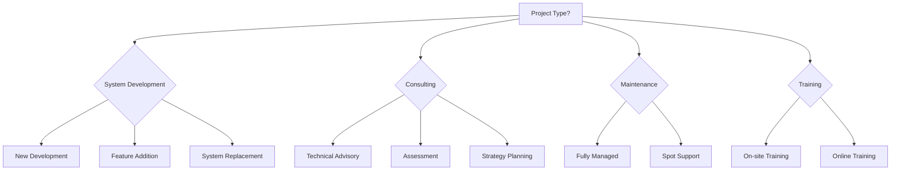

# Estimate Types Guide

Guidelines for creating estimates by project type.

## Table of Contents

- Estimate Type Selection Flow
- System Development
- Consulting
- Maintenance & Operations
- Training
- Combined Estimate Types

## Estimate Type Selection



---

## 1. System Development

### Characteristics
- Clear deliverables (working software)
- Phase-based effort estimation
- Architecture options presentation is effective

### Platform Abstraction Pattern (for MVP/POC)

Use abstracted expressions with assumed platform notes when specific platform is not yet confirmed:

| Specific Expression | Abstracted Expression |
|--------------------|----------------------|
| Shopify Plus | E-commerce platform (assuming Shopify Plus) |
| Shopify Admin API | E-commerce Admin API (assuming Shopify Admin API) |
| Salesforce | CRM (assuming Salesforce) |
| HubSpot | MA (assuming HubSpot) |

**Use Cases:**
- MVP stage when platform is not yet determined
- Phase 2 may require different platform support
- Multiple client environments expected

**Example:**
```markdown
| Layer | Technology | Selection Rationale |
|-------|------------|---------------------|
| E-commerce | E-commerce Admin API (assuming Shopify Admin API) | Sales/customer data retrieval |
| CRM | CRM API (assuming Salesforce) | Customer management integration |
```

### Required Sections
1. Current situation analysis
2. Solution overview
3. Architecture options (if applicable)
4. Technical design details
5. Implementation roadmap (Gantt chart)
6. Estimated costs (phase breakdown)
7. Risks and mitigation

### Cost Structure
```markdown
## Estimated Costs

### Initial Development Costs
| Phase | Hours | Amount |
|-------|-------|--------|
| Requirements & Design | XXh | ¥XXX,XXX |
| Environment Setup | XXh | ¥XXX,XXX |
| Development | XXh | ¥X,XXX,XXX |
| Testing | XXh | ¥XXX,XXX |
| Deployment & Handover | XXh | ¥XXX,XXX |
| PM & Management | XXh | ¥XXX,XXX |
| **Total** | **XXXh** | **¥X,XXX,XXX** |
```

### Effort Guidelines (by Scale)

| Scale | Estimated Hours | Duration | Cost Range |
|-------|-----------------|----------|------------|
| Small (LP, simple tools) | 40-80h | 2-4 weeks | ¥600,000-1,200,000 |
| Medium (business apps) | 200-400h | 2-4 months | ¥3,000,000-6,000,000 |
| Large (core systems) | 800h+ | 6+ months | ¥12,000,000+ |

### Phased Investment Option (System Development)

For large-scale or high-uncertainty projects, consider phase division:

```markdown
## Phased Investment Plan

### Phase 1: MVP Development (3 months)
- Objective: Core functionality validation
- Cost: ¥3,000,000-5,000,000
- Deliverable: Minimum viable system
- Go/No-go Criteria: User satisfaction 70%+

### Phase 2: Feature Expansion (3-6 months)
- Objective: Full feature implementation
- Cost: ¥5,000,000-8,000,000
- Deliverable: Production-ready system
- Go/No-go Criteria: Production deployment review

### Phase 3: Optimization (Ongoing)
- Objective: Performance improvement, enhancement
- Cost: ¥2,000,000-4,000,000/year
- Deliverable: Continuous improvement
```

### Joint Project Considerations (System Development)

| Aspect | Content |
|--------|---------|
| Estimate Scope | Scibit's portion only (other parties' development separate) |
| Interface | Prior agreement on API specifications required |
| Responsibility Boundary | Specify defect isolation method for integration points |
| Schedule Coordination | Buffer for parallel development with other parties |

---

## 2. Consulting

### Characteristics
- Deliverables are reports and recommendations
- Duration/phase-based estimation
- Value based on expertise

### Required Sections
1. Background & objectives
2. Scope
3. Approach & methodology
4. Deliverables list
5. Schedule
6. Estimated costs

### Cost Structure
```markdown
## Estimated Costs

### Consulting Fees
| Phase | Duration | Hours | Amount |
|-------|----------|-------|--------|
| Current State Analysis | 1 week | 20h | ¥300,000 |
| Issue Identification | 1 week | 20h | ¥300,000 |
| Recommendations | 2 weeks | 40h | ¥600,000 |
| Presentation | - | 4h | ¥60,000 |
| **Total** | **4 weeks** | **84h** | **¥1,260,000** |

### Deliverables
- Current state analysis report
- Issue & improvement recommendations
- Roadmap proposal
- Presentation materials
```

### Consulting Types

| Type | Duration | Deliverables |
|------|----------|--------------|
| Quick Assessment | 1-2 weeks | Brief report |
| Technical Advisory | Ongoing | Weekly advice |
| Strategy Planning | 1-2 months | Strategy document |
| PoC Support | 1-3 months | Validation report + prototype |

### Phased Investment Option (Consulting)

For long-term technical support, consider staged engagement:

```markdown
### Stage 1: Assessment (2-4 weeks)
- Objective: Current state understanding, issue extraction
- Cost: ¥500,000-1,000,000
- Deliverable: Current state analysis report
- Next Stage Criteria: Issue severity & priority

### Stage 2: Strategy Development (1-2 months)
- Objective: Solution design
- Cost: ¥1,000,000-2,000,000
- Deliverable: Improvement plan, roadmap
- Next Stage Criteria: Execution approval

### Stage 3: Ongoing Support (Continuous)
- Objective: Execution support, establishment
- Cost: ¥300,000-500,000/month
- Deliverable: Monthly report, ad-hoc advice
```

### Joint Project Considerations (Consulting)

| Aspect | Content |
|--------|---------|
| Scope | Limited to Scibit's expertise (AI/technology) |
| Deliverables | Alignment process with other parties |
| Reporting Line | Reporting method to client/prime contractor |

---

## 3. Maintenance & Operations

### Characteristics
- Monthly-based ongoing contract
- SLA definition is critical
- Clear coverage scope

### Required Sections
1. Target system
2. Service content
3. SLA (Service Level)
4. Support structure
5. Monthly fees
6. Contract terms

### Cost Structure
```markdown
## Maintenance & Operations Costs

### Monthly Base Fee
| Plan | Coverage Hours | Monthly Capacity | Monthly Fee |
|------|----------------|------------------|-------------|
| Light | Weekdays 10-18 | Up to 10h | ¥150,000 |
| Standard | Weekdays 9-21 | Up to 20h | ¥300,000 |
| Premium | 24/7/365 | Up to 40h | ¥600,000 |

### Overage Fees
- Monthly capacity exceeded: ¥15,000/h
- Emergency (nights/weekends): ¥22,500/h (1.5x)

### SLA
| Item | Light | Standard | Premium |
|------|-------|----------|---------|
| Initial Response | Within 4h | Within 2h | Within 30min |
| Recovery Target | Next business day | 8 hours | 4 hours |
| Uptime Guarantee | - | 99.5% | 99.9% |
```

### Included Services (Example)
- Inquiry handling (email/chat)
- Minor fixes & adjustments
- Regular maintenance
- Security updates
- Monthly report

### Excluded Services (Example)
- New feature development
- Major modifications
- Infrastructure costs
- Third-party service outage response

### Joint Project Considerations (Maintenance)

| Aspect | Content |
|--------|---------|
| Coverage | Scibit-responsible components only |
| Escalation | Contact flow for other parties' components |
| SLA Alignment | Consistency with other parties' SLAs |
| Issue Isolation | Clear responsibility boundaries |

---

## 4. Training

### Characteristics
- Headcount/session-based estimation
- Curriculum design is important
- Deliverable is skill acquisition

### Required Sections
1. Training overview & objectives
2. Target audience
3. Curriculum
4. Delivery format
5. Costs

### Cost Structure
```markdown
## Training Costs

### Base Fee Structure
| Format | Rate | Notes |
|--------|------|-------|
| On-site Training | ¥300,000/day | Instructor dispatch, max 20 participants |
| Online Training | ¥200,000/day | Zoom etc., max 30 participants |
| Hands-on | ¥400,000/day | Workshop format, max 10 participants |

### Sample Curriculum: {{Training Topic}}
| Day | Content | Duration |
|-----|---------|----------|
| Day 1 | Fundamentals | 6h |
| Day 2 | Hands-on Practice | 6h |
| Day 3 | Advanced & Q&A | 4h |

### Total Cost
| Item | Amount |
|------|--------|
| Training Delivery (3 days) | ¥900,000 |
| Materials Creation | ¥150,000 |
| **Total** | **¥1,050,000** |
```

### Options
- Custom curriculum development
- Pre-assessment
- Follow-up sessions
- Recording & archive access
- Completion certificates

### Joint Project Considerations (Training)

| Aspect | Content |
|--------|---------|
| Curriculum Coordination | Alignment with other parties' training |
| Materials Sharing | IP rights handling |
| Participant Management | List sharing method |
| Effectiveness Measurement | Joint evaluation criteria |

---

## Combined Estimate Types

For composite projects:

```markdown
## Cost Summary

| Item | Amount |
|------|--------|
| System Development (Initial) | ¥3,000,000 |
| Maintenance (Monthly) | ¥200,000 |
| Training (1 session) | ¥300,000 |
| **Year 1 Total** | **¥5,700,000** |

* Maintenance calculated for 12 months
```
